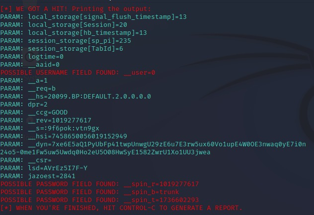

# cibersecurity-desafio-phishing
Este repositório contém recursos para a criação e exploração de um ambiente controlado voltado para o aprendizado e prática de conceitos relacionados a ataques de phishing.

### Ferramentas

- Kali Linux
- setoolkit

### Configurando o Phishing no Kali Linux

- Acesso root: ``` sudo su ```
- Iniciando o setoolkit: ``` setoolkit ```
- Tipo de ataque: ``` Social-Engineering Attacks ```
- Vetor de ataque: ``` Web Site Attack Vectors ```
- Método de ataque: ```Credential Harvester Attack Method ```
- Método de ataque: ``` Site Cloner ```
- Obtendo o endereço da máquina: ``` ifconfig ```
- URL para clone: http://www.facebook.com

### **3. Resultado**



- O SEToolkit clonou o site do Facebook e configurou o ambiente para capturar credenciais inseridas.
- **Problema Encontrado**:
  - As credenciais inseridas não foram capturadas corretamente. Em vez disso, informações como \`__spin_r=1019...\` foram exibidas.
  - **Motivo**:
    - O Facebook utiliza várias medidas de segurança modernas, como tokens dinâmicos, encriptação de entrada e validações JavaScript, que impedem a captura de credenciais em clones simples.

---

## **Aviso**

> **Nota:** Este repositório é estritamente para fins educacionais e deve ser utilizado apenas em ambientes controlados e com permissão explícita. O uso indevido pode ter consequências legais e éticas.
